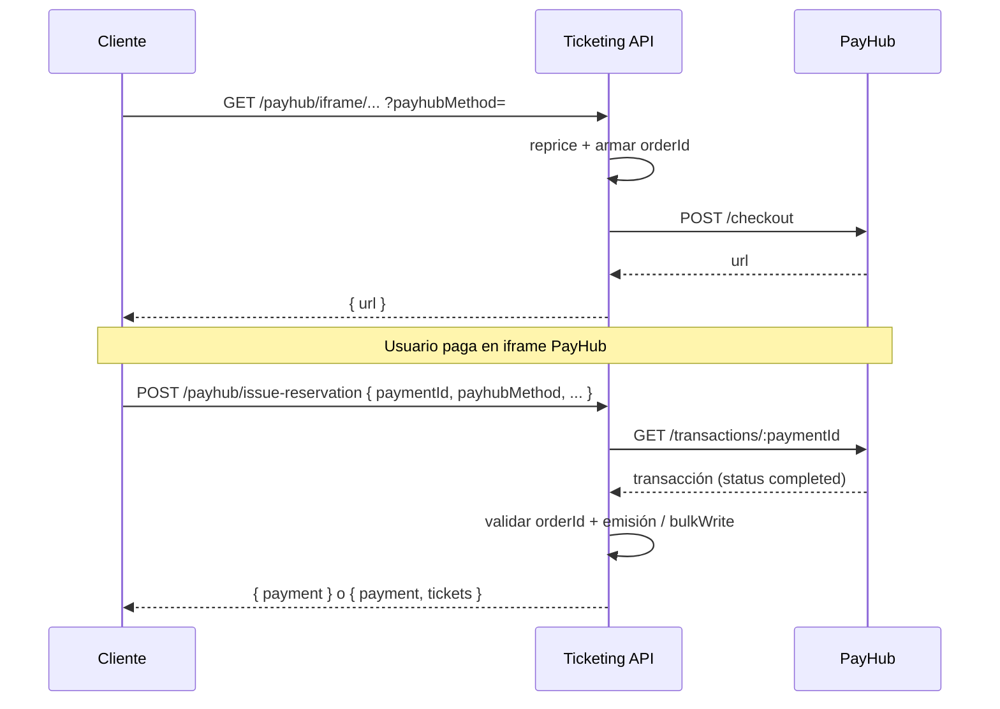

# Endpoints PayHub (API v1)

Documentación de las rutas HTTP expuestas para el flujo de pago embebido con PayHub: generación de URL de checkout (`iframe`) y cierre operativo tras pago aprobado (`issue-reservation`).

**Prefijo base:** `/api/v1/payhub`

**Autenticación en estos endpoints:** no hay middleware de usuario/admin en las rutas registradas en `src/index.js`; la confianza recae en conocer `reservationCode` / `purchaseOrder` y, en `issue-reservation`, en validar el pago contra PayHub con `paymentId`.

---

## Variables de entorno relevantes

| Variable        | Uso |
|-----------------|-----|
| `PAYHUB_URL`    | Base URL del API PayHub (p. ej. creación de checkout y consulta de transacciones). |
| `PAYHUB_KEY`    | Bearer token usado al llamar a PayHub (`/checkout`, `/transactions/:id`). |
| `PAYHUB_KEY_TAC` | (Opcional) clave por planner; expuesta en `getPayhubKey` para planners concretos; la verificación HTTP actual usa `PAYHUB_KEY` global. |

En el **Event planner** debe existir `payhubClient` (identificador de cliente en PayHub).

---

## `GET /api/v1/payhub/iframe/:reservationCode`

Obtiene la URL del checkout embebido de PayHub para una **reserva** identificada por `reservationCode`.

### Parámetros de ruta

| Parámetro          | Descripción |
|--------------------|-------------|
| `reservationCode`  | Código de la reserva en el sistema de ticketing. |

### Query string

| Parámetro       | Descripción |
|-----------------|-------------|
| `payhubMethod`  | Método de pago interno (ver [Métodos y mapeo PayHub](#métodos-y-mapeo-payhub)). Se usa para repricing y para armar `payment_methods` en PayHub. |

### Comportamiento (caso de uso `iframe`)

1. Carga la reserva con `event` / `seasonTicket` y `user`, y `eventPlanner` poblado.
2. Ejecuta `reprice` con `reservationCode` y `payhubMethod`.
3. Arma `orderId` como `{eventPlanner.code}-{reservationCode}-{ordenAleatorio}`.
4. Monto: para planners `CESAREP` o `B9DEMO` se fuerza `1`; si la moneda derivada del método es `VES`, usa `repriceReservation.price.totalAmountVES`; si no, `totalAmount`.
5. `POST {PAYHUB_URL}/checkout` con modo `embedded`, email del usuario, `client: eventPlanner.payhubClient`, etc.
6. Respuesta exitosa: objeto JSON con `url` (URL del iframe/checkout).

### Respuestas HTTP

| Código | Cuerpo |
|--------|--------|
| `200`  | `{ "url": "<url_checkout_payhub>" }` |
| `400`  | `{ "error": <objeto_error> }` (el controlador devuelve la excepción capturada tal cual). |

Errores típicos del caso de uso: fallo de PayHub (`message` desde respuesta o *"Error al generar la orden"*), reserva no encontrada o errores en repricing según dependencias.

---

## `GET /api/v1/payhub/iframe/po/:purchaseOrder`

Misma finalidad que el endpoint anterior, pero para una **orden de compra** (`purchaseOrder`) que puede agrupar varias reservas.

### Parámetros de ruta

| Parámetro        | Descripción |
|------------------|-------------|
| `purchaseOrder`  | Identificador de la orden de compra. |

### Query string

| Parámetro       | Descripción |
|-----------------|-------------|
| `payhubMethod`  | Igual que en el flujo por reserva. |

### Comportamiento

1. `repricePurchaseOrder` con `purchaseOrder` y método.
2. Toma la primera reserva del resultado para usuario, producto y planner.
3. `orderId` en PayHub: `{eventPlanner.code}-PO:{purchaseOrder}-{ordenAleatorio}`.

### Respuestas HTTP

Igual que `GET .../iframe/:reservationCode` (`200` con `url`, `400` con `error`).

---

## `POST /api/v1/payhub/issue-reservation`

Confirma el pago ante PayHub y **materializa** el negocio: emisión de tickets / actualización de reservas según el tipo de operación.

### Cuerpo JSON (`application/json`)

| Campo              | Obligatorio | Descripción |
|--------------------|------------|-------------|
| `paymentId`        | Sí         | Identificador de la transacción en PayHub (se consulta vía API de transacciones). |
| `payhubMethod`     | Sí         | Debe ser coherente con el usado en el iframe/repricing. |
| `reservationCode`  | Condicional | Presente en flujo **reserva simple** (sin `purchaseOrder`). |
| `purchaseOrder`    | Condicional | Presente en flujo **orden de compra** (sin `reservationCode` como flujo principal de PO). |

**Regla:** el código distingue por presencia de `purchaseOrder` (truthy) frente al flujo solo con `reservationCode`.

### Flujo A — con `purchaseOrder`

1. `repricePurchaseOrder` y obtención del `eventPlanner`.
2. `verifyPayment({ paymentId, eventPlanner })`: llama a `GET {PAYHUB_URL}/transactions/{paymentId}` con `Authorization: Bearer {PAYHUB_KEY}`; exige `status === "completed"`.
3. Valida que el segmento de `orderId` del pago coincida con `PO:{purchaseOrder}` (comparación con `payment.orderId.split("-")[1]`).
4. `bulkWrite` sobre reservas del PO (precios, ubicaciones, impuestos, `igtfInfo.paymentId` si aplica).
5. `issuePurchaseOrder({ purchaseOrder, payment })` con objeto de pago (`currency`, `ref`, `paymentId`).
6. Respuesta: `{ "payment": <respuesta_payhub> }`.

### Flujo B — con `reservationCode` (sin PO)

1. Carga reserva con `user`, `event` / `seasonTicket` / `multiEvent` y `eventPlanner`.
2. `verifyPayment({ paymentId, eventPlannerCode })` (misma llamada HTTP a PayHub que arriba).
3. Valida que `payment.orderId.split("-")[1] === reservation.reservationCode`.
4. `addPayment`, `issueTickets`, `reprice`, `createSale`, log `order_created`, creación de `order` y `updateOne` de la reserva (precio, impuestos, ubicaciones, orden).
5. Respuesta: `{ "payment": ..., "tickets": ... }`.

### Respuestas HTTP

| Código | Cuerpo |
|--------|--------|
| `200`  | PO: `{ "payment": ... }`. Reserva: `{ "payment": ..., "tickets": ... }`. |
| `400`  | `{ "error": <objeto_error> }`. |

Mensajes de negocio explícitos en el caso de uso:

- *"Orden de compra invalida"* — `orderId` del pago no coincide con el PO.
- *"Reserva invalida"* — `orderId` del pago no coincide con la reserva.
- *"Pago no aprobado"* / errores de API — desde `verify-payment` y respuestas PayHub.

---

## Endpoint no expuesto: verificación directa

En `src/index.js` existe una ruta **comentada**:

```text
// GET /api/v1/payhub/verify/:paymentId
```

El controlador `verifyPayment` reutiliza la misma factory que `getIframe` (`makeGetIframe`), por lo que esperaría `paymentId` en `params` y devolvería el JSON de la transacción si la verificación interna no lanza error. **No está activa** en el servidor actual; la verificación se usa de forma interna desde `issue-reservation`.

---

## Métodos y mapeo PayHub

Definidos en `src/uses-cases/pay-hub/payhub-helpers.js` (resumen):

| `payhubMethod` | Moneda (`currencyType`) | `gateway` (PayHub)   | `method` / tipo |
|----------------|-------------------------|----------------------|-----------------|
| `R4C2P`        | `VES`                   | `r4`                 | `c2p`           |
| `BTC2P`        | `VES`                   | `banco_del_tesoro`   | `c2p`           |
| *(otro)*       | `USD`                   | `""`                 | `""`            |

El objeto enviado a PayHub usa `currency` en minúsculas y el array `payment_methods` con `method`, `gateway` y `currency`.

---

## Diagrama de flujo (alto nivel)



---

## Archivos de referencia en el repositorio

| Pieza            | Ruta |
|------------------|------|
| Rutas            | `src/index.js` (sección `//payhub`) |
| Controladores    | `src/controllers/payhub-controller/` |
| Iframe / checkout| `src/uses-cases/pay-hub/iframe.js` |
| Verificación     | `src/uses-cases/pay-hub/verify-payment.js` |
| Emisión post-pago| `src/uses-cases/pay-hub/issue-reservation.js` |
| Mapeo métodos    | `src/uses-cases/pay-hub/payhub-helpers.js` |
| Composición DI   | `src/uses-cases/pay-hub/index.js` |
